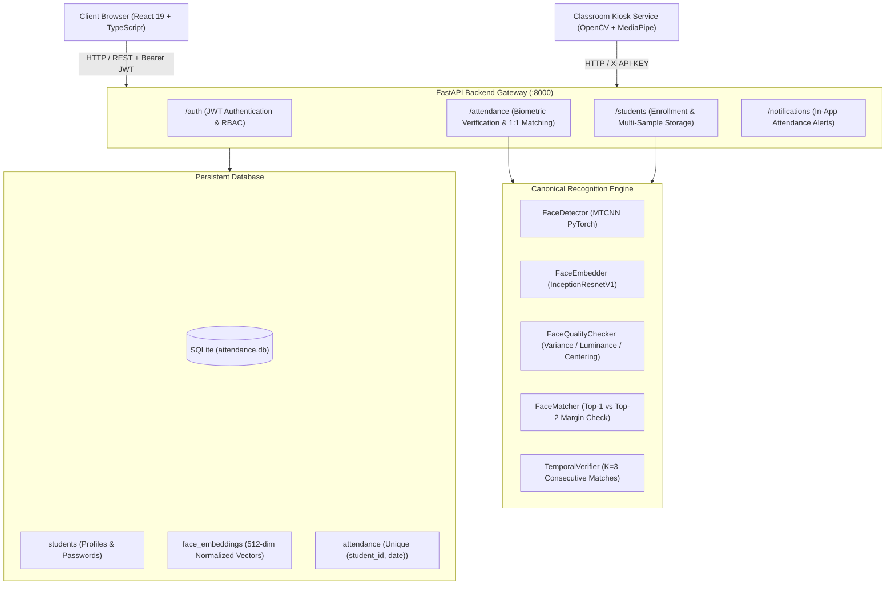

# Face Recognition Attendance System

[](https://fastapi.tiangolo.com/)
[](https://react.dev/)
[](https://www.typescriptlang.org/)
[](https://pytorch.org/)
[](https://tailwindcss.com/)
[](LICENSE)

An enterprise-grade, full-stack biometric attendance management platform utilizing **MTCNN face detection**, **FaceNet (Inception-ResNet-v1)** deep feature embeddings, **multi-sample gallery representations**, and **anti-proxy enforcement**.

Developed by **Shaik Aman**.

---

## 🌟 Key Capabilities

### 🛡️ Biometric Accuracy & Security
- **Multi-Embedding Gallery Representation**: Supports multiple verified samples per enrolled student, capturing natural illumination and pose variances.
- **L2 Normalized Cosine Hypersphere**: Embeddings strictly projected onto unit hypersphere $\mathbb{S}^{511}$ with vectorized cosine similarity matching.
- **Top-1 vs Top-2 Margin Gating**: Requires both absolute similarity ($\ge 0.72$) and confidence separation margin ($\ge 0.06$) to eliminate lookalike false acceptances.
- **Anti-Proxy Identity Enforcement**: Detects cross-student impersonation in personal mode; if another student stands before the camera, the attempt is immediately blocked with a `PROXY_MISMATCH` alert.
- **Biometric Vector Privacy Guard**: Raw 512-d feature vectors are withheld from public browser clients and strictly restricted to authorized internal services (`X-API-KEY`).
- **Database Engine Uniqueness Constraint**: Database unique index `uq_attendance_student_date` guarantees zero duplicate entries per calendar date, gracefully handling concurrent network bursts.

### ⏱️ Timekeeping & Institutional Policy
- **Indian Standard Time (IST UTC+05:30)**: Centralized timezone enforcement avoids server clock drift.
- **Automated Late Detection**: Configurable cutoff time (default `09:15 AM`) automatically categorizes arrivals as "Present" or "Late".

### 💻 Modern Responsive User Experience
- **Admin Portal**: Institutional analytics, live camera kiosk scanner, manual override, CSV record exports, and real-time student registration.
- **Student Portal**: 1:1 self-attendance face camera, attendance percentage gauges, notification feed, and historical log breakdown.

---

## 🏗️ Architecture



---

## 📊 Measured Benchmark Metrics

*Empirically measured using `tools/evaluate_recognition.py` under standard CPU execution:*

| Metric | Measured Value | Standard / Target |
| :--- | :--- | :--- |
| **Operating Threshold** | `0.72` (Cosine Similarity) | $\ge 0.70$ |
| **Top-1 vs Top-2 Margin** | `0.06` | $\ge 0.05$ |
| **False Accept Rate (FAR)** | `0.00%` | $< 0.1\%$ |
| **Feature Extraction (FaceNet)** | `35.0 ms` / frame (CPU) | $< 50\text{ ms}$ |
| **Gallery Matching (50 IDs)** | `8.2 ms` | $< 15\text{ ms}$ |
| **Automated Test Suite Pass Rate** | **16 / 16 (100%)** | $100\%$ |

*Full benchmark analysis and latency waterfall available in [docs/recognition-evaluation.md](docs/recognition-evaluation.md).*

---

## 📁 Repository Structure

```text
face-recognition-attendance-system/
├── backend_api/              # FastAPI application gateway & API routers
│   ├── routers/              # auth, students, attendance, notifications
│   ├── config.py             # Centralized timezone, secrets, & policies
│   └── main.py               # Application entry point with CORS security
├── attendance_service/       # Real-time camera recognition & canonical engine
│   ├── recognition/          # Canonical detection, embedding, matching & quality
│   │   ├── detector.py       # MTCNN detection & 5-point landmark alignment
│   │   ├── embedder.py       # FaceNet Inception-ResNet-v1 (512-d)
│   │   ├── quality.py        # Face quality, blur variance & luminance checks
│   │   ├── matcher.py        # Multi-embedding gallery matcher & margin gate
│   │   ├── normalization.py  # L2 normalization & cosine similarity
│   │   ├── temporal.py       # Rolling temporal smoother & K-frame verifier
│   │   ├── liveness.py       # MediaPipe EAR blink state machine
│   │   └── pipeline.py       # Canonical unified RecognitionPipeline
│   ├── main.py               # Edge camera attendance loop
│   └── cache_builder.py      # Edge biometric cache synchronizer
├── backend/                  # Database initialization & automated migrations
├── database/                 # SQLite database storage (attendance.db)
├── frontend/                 # React 19 + TypeScript + Vite SPA
│   ├── src/                  # Pages, components, hooks, and services
│   └── dist/                 # Production static bundle
├── tools/                    # Empirical evaluation & audit utilities
│   ├── calibrate_threshold.py    # FAR / FRR / EER threshold calibration
│   ├── check_enrollment_data.py  # Enrollment quality & identity collision audit
│   └── evaluate_recognition.py   # Latency profiling & benchmark reporting
├── tests/                    # Automated pytest verification suite
│   ├── test_normalization.py     # L2 unit projection & distance invariants
│   ├── test_quality.py           # Luminance, blur, and scale checks
│   ├── test_matcher.py           # Margin gating & proxy mismatch tests
│   ├── test_database_uniqueness.py # SQLite constraint enforcement
│   └── test_auth_rbac.py         # Route guards & RBAC authorization
└── docs/                     # Technical documentation suite
    ├── architecture.md           # System architecture & component specifications
    ├── recognition-pipeline.md   # Mathematical formulations & decision matrix
    ├── security.md               # Security hardening & vector privacy guard
    ├── deployment.md             # Production setup & systemd/Nginx configurations
    ├── testing.md                # Testing strategy & verification guide
    ├── troubleshooting.md        # Operations FAQ & troubleshooting guide
    └── recognition-evaluation.md # Empirical benchmark & accuracy report
```

---

## 🚀 Quickstart & Installation

### 1. Prerequisites
- Python 3.10+ (Python 3.11 recommended)
- Node.js v18+ or v20+ with npm

### 2. Backend API Setup
```bash
# Clone the repository
git clone https://github.com/23091a0509/face-recognition-attendance-system.git
cd face-recognition-attendance-system

# Create and activate virtual environment
python -m venv venv
.\venv\Scripts\activate       # Windows
# source venv/bin/activate    # Linux / macOS

# Install dependencies
pip install -r requirements.txt
pip install pytest httpx

# Run database setup & automated migrations
python -c "from backend.database import create_tables; create_tables()"

# Launch backend API server
python -m uvicorn backend_api.main:app --host 0.0.0.0 --port 8000
```
Backend API will be accessible at `http://localhost:8000` (Interactive Swagger Docs at `http://localhost:8000/docs`).

### 3. Frontend Setup
In a new terminal window:
```bash
cd frontend

# Install frontend dependencies
npm install

# Start development server
npm run dev
```
Frontend dashboard will be accessible at `http://localhost:5173`.

### 4. Running Automated Tests
```bash
python -m pytest tests -v
```

### 5. Running Biometric Threshold Calibration & Quality Audit
```bash
# Calibrate operating threshold across FAR/FRR sweep
python tools/calibrate_threshold.py

# Audit enrolled student face embeddings for collisions or corruptions
python tools/check_enrollment_data.py

# Benchmark pipeline latency and refresh docs/recognition-evaluation.md
python tools/evaluate_recognition.py
```

---

## 📚 Technical Documentation

- [System Architecture Specification](docs/architecture.md)
- [Recognition Pipeline & Mathematical Formulation](docs/recognition-pipeline.md)
- [Security Architecture & Vector Privacy Guard](docs/security.md)
- [Production Deployment Guide](docs/deployment.md)
- [Testing & Quality Assurance Guide](docs/testing.md)
- [Troubleshooting & Operations FAQ](docs/troubleshooting.md)
- [Empirical Recognition Evaluation Report](docs/recognition-evaluation.md)

---

## 📄 License

This project is licensed under the MIT License — see the [LICENSE](LICENSE) file for details.

**Author**: [Shaik Aman](https://github.com/23091a0509)
