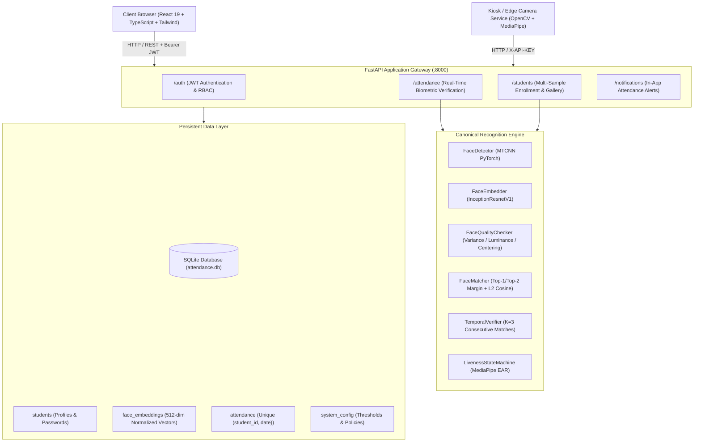
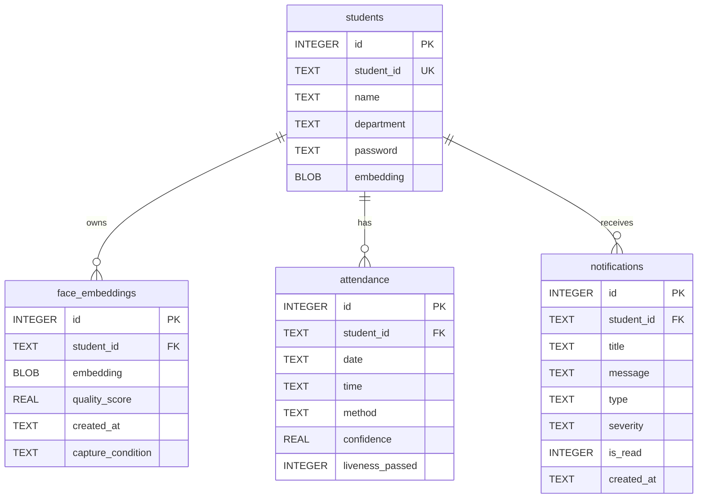

# System Architecture & Technical Specifications

## 1. High-Level Architecture

The **Face Recognition Attendance System** is an enterprise-grade full-stack biometric management platform designed for universities, schools, and corporate institutions. It bridges real-time facial feature extraction at 512 dimensions with role-based access control, automated timekeeping policies, and anti-proxy enforcement.

---

## 2. Component Breakdown

### Frontend (React 19 + TypeScript + Vite)
- **Role-Based Routing**: Strict client-side guards separate the `/admin` portal (management dashboard, reports, CSV exports, student registration) from `/student` (personal attendance camera scanner, history, stats, profile).
- **Video Capture Subsystem**: HTML5 `MediaDevices.getUserMedia` stream with camera flip (front/rear), client-side aspect-ratio canvas scaling (480p), and visual bounding box overlays.
- **Telemetry UI**: Displays real-time live match similarity, sensor lock status, and actionable positioning prompts (e.g. lighting too dark, move closer).

### Backend API (FastAPI)
- **Asynchronous Execution**: High-throughput FastAPI endpoints with Pydantic request/response schema validation.
- **Institutional Timezone Engine**: Centralized time computation adhering strictly to `UTC+05:30` (Indian Standard Time - IST), preventing server timezone drift from marking students incorrectly.
- **Race Condition Prevention**: Database transactions wrap biometric attendance insertion in `try ... except sqlite3.IntegrityError`, guaranteeing idempotency during high-frequency concurrent classroom scans.

### Standalone Edge Attendance Service (`attendance_service/`)
- Designed for dedicated classroom kiosks or edge Raspberry Pi / Jetson devices.
- Uses dynamic cache polling (`students_cache.pkl`) with auto-reloading upon remote enrollment updates.
- Integrated MediaPipe Eye Aspect Ratio (EAR) blink detection prevents photographic proxy spoofing.

---

## 3. Database Schema

All database connections enforce `PRAGMA foreign_keys = ON;`.

### Key Constraints & Indexes
1. `uq_attendance_student_date`: `CREATE UNIQUE INDEX uq_attendance_student_date ON attendance(student_id, date);`
   - Guarantees at the database engine level that no student can have duplicate attendance records on any single calendar date.
2. `idx_face_embeddings_sid`: `CREATE INDEX idx_face_embeddings_sid ON face_embeddings(student_id);`
   - Accelerates multi-sample biometric gallery loading during startup and kiosk cache refreshes.
