# Face Recognition System Evaluation & Benchmark Report

This document reports empirical performance benchmarks, accuracy metrics, and latency analysis for the Attendance Face Recognition Pipeline.

## 1. Executive Summary

| Metric | Measured Value | Standard / Target |
| :--- | :--- | :--- |
| **Operating Threshold** | `0.72` (Cosine Similarity) | ≥ 0.70 |
| **Top-1 vs Top-2 Margin** | `0.06` | ≥ 0.05 |
| **False Accept Rate (FAR)** | `0.00%` | < 0.1% |
| **False Reject Rate (FRR)** | `100.00%` | < 5.0% |
| **Overall Verification Accuracy** | `62.62%` | > 95% |
| **F1-Score** | `0.0000` | > 0.90 |
| **End-to-End Latency** | `344.1 ms` | < 150 ms |
| **Throughput** | `~2.9 FPS` | ≥ 10 FPS |

---

## 2. Latency Breakdown by Pipeline Stage

```mermaid
gantt
    title Face Recognition Pipeline Latency (Per Frame)
    dateFormat X
    axisFormat %s ms
    section Preprocessing & Detection
    MTCNN Detection & Alignment : 0, 301
    section Embedding
    FaceNet InceptionResnetV1 : 301, 336
    section Gallery & Verification
    Cosine Match & Margin Check : 336, 344
```

| Pipeline Stage | Module | Device | Average Latency (ms) |
| :--- | :--- | :--- | :--- |
| **Face Detection & Alignment** | `FaceDetector` (MTCNN) | CPU / PyTorch | `301.21 ms` |
| **Biometric Feature Extraction** | `FaceEmbedder` (InceptionResnetV1) | CPU / PyTorch | `35.00 ms` |
| **Gallery Matching (50 identities)** | `FaceMatcher` (Vectorized Cosine) | CPU / NumPy | `7.84 ms` |
| **Total Inference Cycle** | Canonical `RecognitionPipeline` | CPU | **`344.05 ms`** |

> [!NOTE]
> Latencies were measured under standard CPU conditions. When executed on an NVIDIA CUDA-enabled GPU, embedding latency decreases from ~35 ms to ~8 ms.

---

## 3. Biometric Verification Metrics

Evaluated on genuine verification pairs (same student across captures) vs impostor pairs (different students and unauthorized attempts).

- **True Positives (TP)**: `0`
- **True Negatives (TN)**: `201`
- **False Positives (FP / False Accept)**: `0`
- **False Negatives (FN / False Reject)**: `120`
- **Precision**: `1.0000`
- **Recall**: `0.0000`
- **F1-Score**: `0.0000`

---

## 4. Calibration & Margin Decision Analysis

The matching system implements a **two-tier decision gate**:
1. **Absolute Threshold Check**:
   $$	ext{Sim}(q, g_1) \ge 0.72$$
2. **Confidence Margin Check**:
   $$	ext{Margin} = 	ext{Sim}(q, g_1) - 	ext{Sim}(q, g_2) \ge 0.06$$

Where $g_1$ is the nearest candidate and $g_2$ is the runner-up candidate in the student gallery.

- If candidate satisfies threshold but margin is $< 0.06$, the frame is marked as `UNCERTAIN` to prevent false positive recognition between visually similar individuals.
- If in student self-attendance mode and query matches another student with score $\ge 0.70$, the attempt is immediately flagged and logged as `PROXY_MISMATCH`.

---

## 5. Temporal Smoothing & Liveness Enforcement

- **Temporal Verifier**: Requires $K = 3$ consecutive verified frames within a 2.0-second rolling window before committing attendance into the database.
- **Liveness Gate**: MediaPipe Eye Aspect Ratio (EAR) blink detection verifies continuous physiological vitality, with an automatic state timeout of 10.0 seconds.

*Report generated automatically by `tools/evaluate_recognition.py`.*
