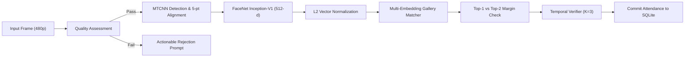

# Biometric Recognition Pipeline & Mathematical Formulation

## 1. Pipeline Overview

The biometric recognition pipeline translates raw camera video streams into high-confidence biometric identity verifications through a 7-stage sequential processing graph.

---

## 2. Mathematical Formulations

### Stage 1: Quality & Blur Assessment
Image blur is evaluated by computing the discrete Laplace operator variance over the grayscale face crop:

$$\nabla^2 I(x, y) = \frac{\partial^2 I}{\partial x^2} + \frac{\partial^2 I}{\partial y^2}$$

$$\text{Var}_{\text{blur}} = \frac{1}{N} \sum_{x, y} \left( \nabla^2 I(x, y) - \mu_{\nabla^2} \right)^2$$

- If $\text{Var}_{\text{blur}} < 22.0$, the frame is rejected with `"Image is blurry, please hold still"`.
- If mean luminance $\bar{L} < 30.0$, the frame is rejected with `"Lighting too dark, please face a light source"`.
- If mean luminance $\bar{L} > 235.0$, the frame is rejected with `"Lighting overexposed, please adjust angle"`.

### Stage 2: Face Alignment & Inception-ResNet-v1 Embedding
MTCNN detects bounding box $[x_1, y_1, x_2, y_2]$ and 5 facial landmarks (left eye, right eye, nose, left mouth corner, right mouth corner). An affine similarity transformation aligns the eye line horizontally before extracting the standardized $160 \times 160 \times 3$ crop.

The aligned crop is passed through the `InceptionResnetV1` deep convolutional network pretrained on VGGFace2, yielding a raw feature vector $\mathbf{v} \in \mathbb{R}^{512}$.

### Stage 3: L2 Vector Normalization
All embedding vectors are strictly projected onto the unit hypersphere $\mathbb{S}^{511}$:

$$\hat{\mathbf{v}} = \frac{\mathbf{v}}{\|\mathbf{v}\|_2 + \epsilon} = \frac{\mathbf{v}}{\sqrt{\sum_{i=1}^{512} v_i^2} + 10^{-9}}$$

This guarantees that the Euclidean distance $D(\mathbf{u}, \mathbf{w})$ and cosine similarity $\cos(\mathbf{u}, \mathbf{w})$ are directly related by:

$$D^2(\hat{\mathbf{u}}, \hat{\mathbf{w}}) = 2 - 2 \langle \hat{\mathbf{u}}, \hat{\mathbf{w}} \rangle$$

### Stage 4: Multi-Sample Gallery Matching
For a gallery of $M$ students where student $j$ possesses $S_j$ enrollment samples $\{\mathbf{e}_{j, 1}, \mathbf{e}_{j, 2}, \dots, \mathbf{e}_{j, S_j}\}$:

$$\text{Sim}(q, j) = \max_{k \in [1, S_j]} \langle \hat{\mathbf{q}}, \hat{\mathbf{e}}_{j, k} \rangle$$

Let $g_1$ be the top candidate and $g_2$ be the runner-up candidate:

$$g_1 = \arg\max_j \text{Sim}(q, j), \quad s_1 = \max_j \text{Sim}(q, j)$$

$$s_2 = \max_{j \ne g_1} \text{Sim}(q, j)$$

$$\text{Margin}(q) = s_1 - s_2$$

### Stage 5: Decision Matrix & Anti-Proxy Policy
1. **Authenticated / Known Identity**:
   $$s_1 \ge \tau \quad \text{AND} \quad \text{Margin}(q) \ge \Delta_{\text{margin}}$$
   *(Default: $\tau = 0.72$, $\Delta_{\text{margin}} = 0.06$)*
2. **Uncertain Match (Triage)**:
   $$(\tau - 0.08) \le s_1 < \tau \quad \text{OR} \quad \text{Margin}(q) < \Delta_{\text{margin}}$$
   *(Prompts student to look directly into camera without recording false positives).*
3. **Anti-Proxy Block in Personal Mode**:
   If student $A$ is logged in, but $\text{Sim}(q, B) \ge 0.70$ where $B \ne A$, the system triggers a `PROXY_MISMATCH` alert and refuses attendance.

### Stage 6: Temporal Verification
Single-frame fluctuations (e.g. lighting spikes or camera occlusion) are prevented by requiring $K$ consistent predictions in a rolling time window $W$:

$$\sum_{t \in W} \mathbb{I}(\hat{y}_t = g_1) \ge 3 \quad (W = 2.0 \text{ s})$$
